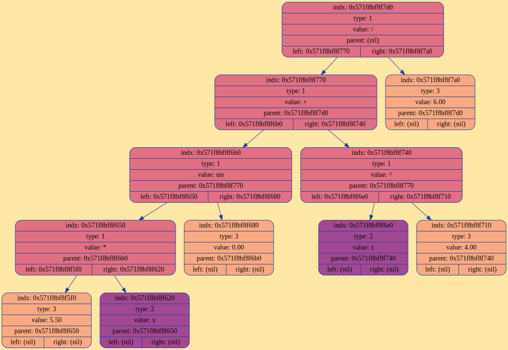
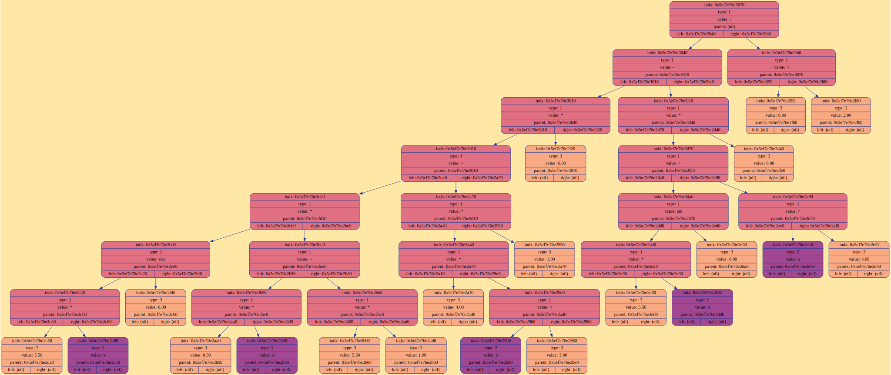
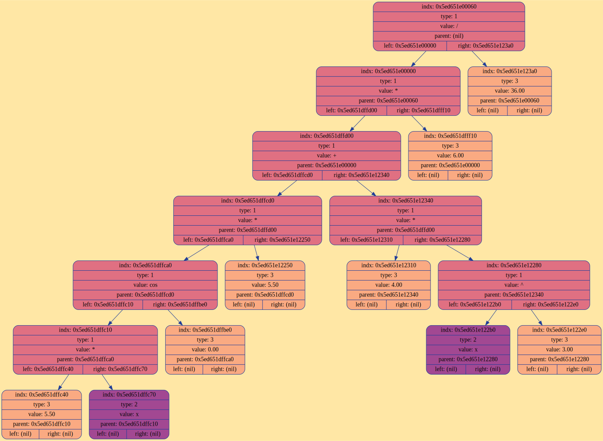
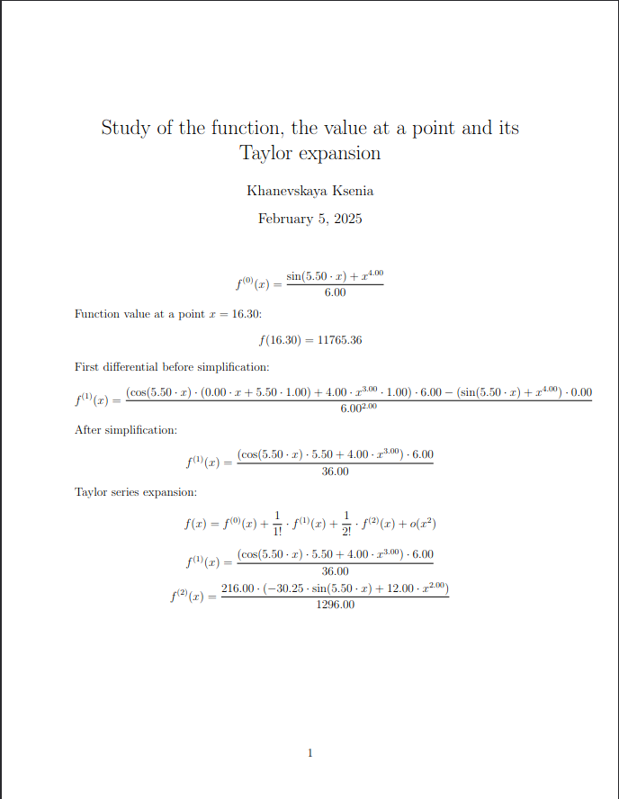

# Дифференциатор

## Введение

Данный проект представляет собой программу, которая:
1. Считает значение введённого пользователем выражения, подставляя значение переменной X
2. Находит первую производную
3. Раскладыает функцию в ряд Маклорена до o(x<sup>2</sup>)
4. Представляет результаты в формате pdf-файла, написанного с помощью LaTeX

Дифференциатор поддерживает следующие математические функции:
* Сложение: `+`
* Вычитание: `-`
* Умножение: `*`
* Деление: `/`
* Возведение в натуральную степень: `^`
* Синус: `sin(x)`
* Косинус: `cos(x)`
* Логарифм: `ln(x)`

Программа масштабируема, другие математические функции можно легко добавить.

> [!NOTE]
>
> Программа поддерживает тип данных double, поэтому ограничений на числовые значения нет

## Скачивание и установка проекта

Для установки программы используются утилиты `make` и `git`.

```CMake
    git clone git@github.com:ksshkh/differentiator.git
    make
```

## Формат ввода данных

Пользователь вводит в файл выражение. Пример ввода (наличие пробелов между знаками не обязательно):

```
(sin(5.5 * x) + x ^ 4) / 6
```

При запуске программы можно ввести числовое значение, которое будет подставлено в выражение вместо переменной, например:

```Bash
    ./diff 16.3
```
Если никакое числовое значение введено не будет, по умолчанию подставится значение x = 120.00

## Принцип работы

1. С помощью рекурсивного спуска строится дерево выражения:
(цвет узла соответсвует типу его данных)



2. Выражение дифференцируется (дерево преобразовывается в соотвтествии с прописанными в функциях правилами):



3. Выражение упрощается:
(такие действия, как +- 0; 0 */; */ 1; ^ 0, 1; арифметические действия, включающие в себя исключительно числа)



Результат работы программы:

